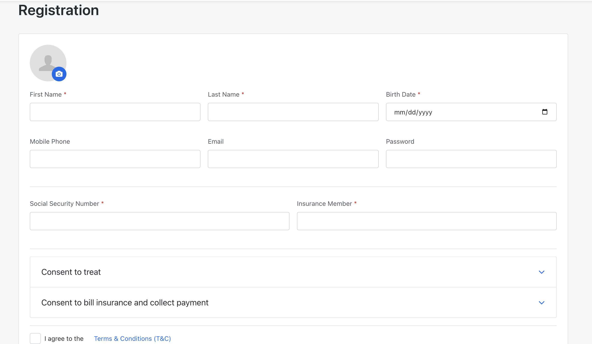
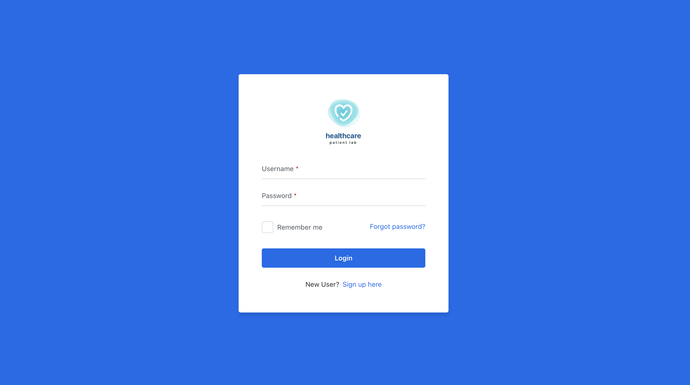
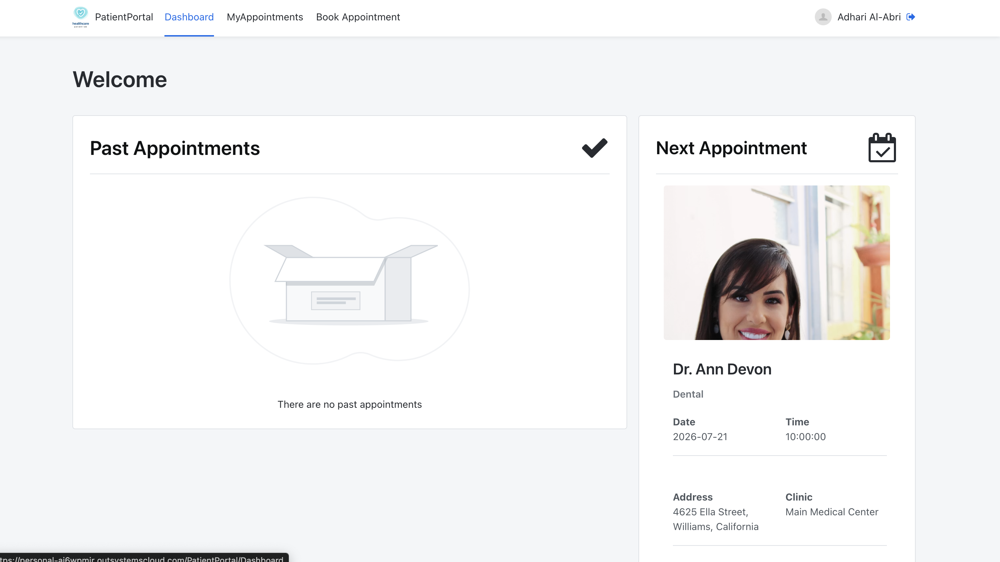
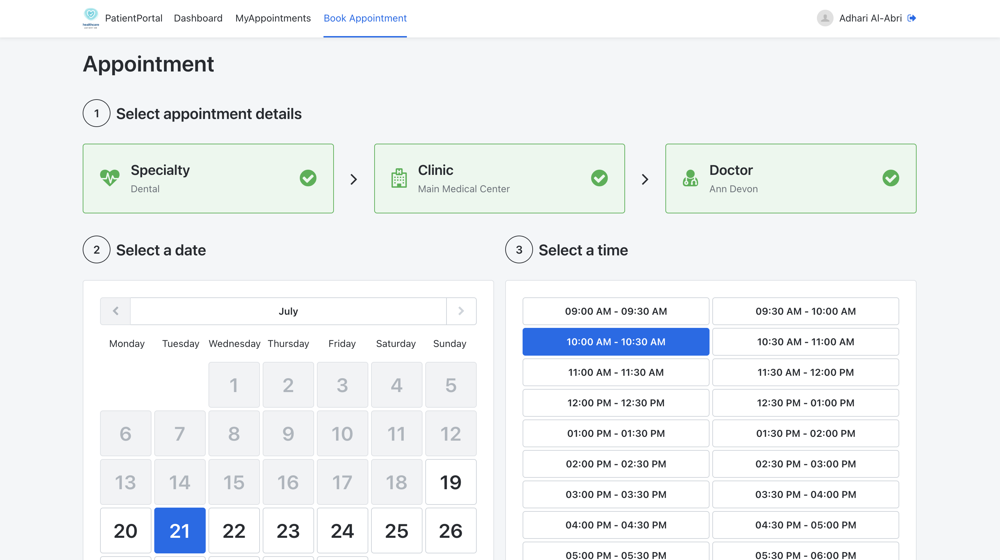
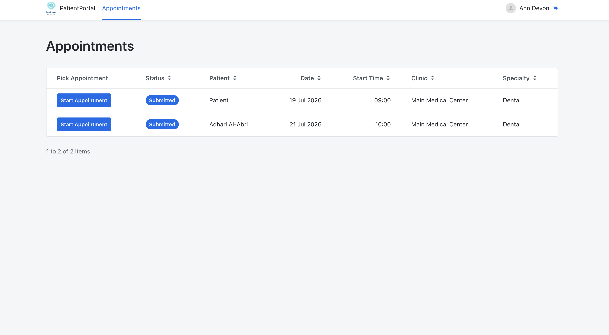
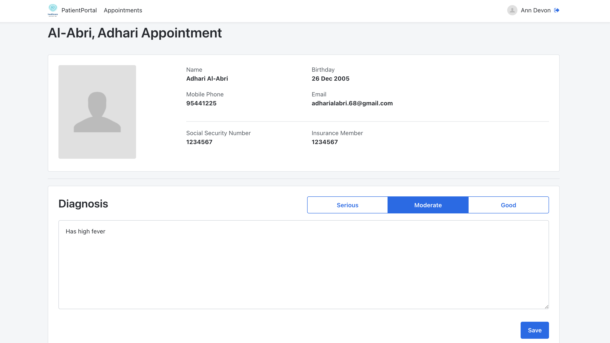
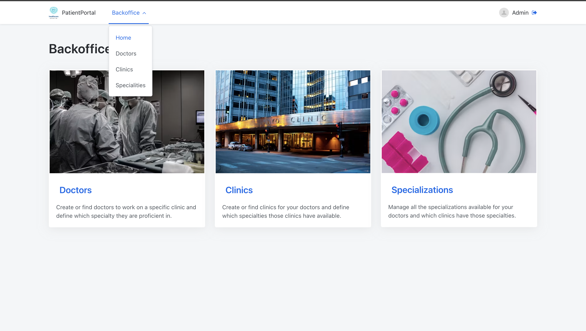
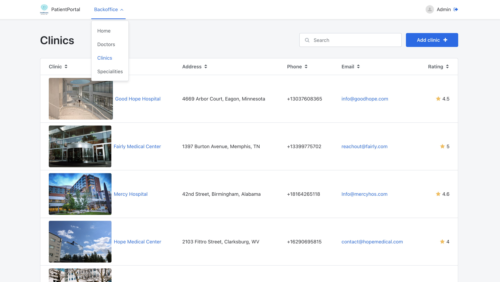
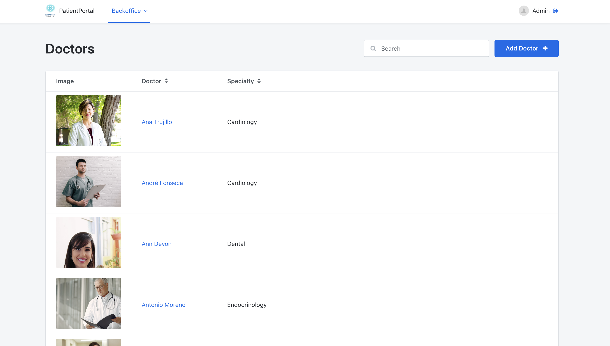

# OutSystems-Patient-Portal
Patient Portal System having doctor, patient and admin roles

A full-stack **Patient Portal System** built using **OutSystems**, designed to streamline the interaction between patients, doctors, and administrators. The application provides role-based access with dedicated dashboards and functionalities for each user type.

---

# Table of Contents

- Overview
- Website URL
- Login Credentials
- Features
- User Roles
- System Screenshots
- Future Improvements

---

# Overview

The Patient Portal System simplifies healthcare management by allowing patients to book and manage appointments, doctors to review appointments and record diagnoses, and administrators to manage the healthcare infrastructure including clinics, doctors, and specializations.

The application consists of three different user roles:

- 👤 Patient
- 👨‍⚕️ Doctor
- 👨‍💼 Administrator

Each role has its own dashboard and permissions.

---
# Website URL

**Application URL**

(https://personal-aj6wpmjr.outsystemscloud.com/PatientPortal/Login)

---
# Login Credentials

## Administrator

| Username | Password |
|----------|----------|
| Admin1 | admin1234 |

---

## Doctor

| Username | Password |
|----------|----------|
| anndevon@gmail.com | doctor1234 |

---

## Patient

| Username | Password |
|----------|----------|
| adharialabri.68@gmail.com | user1234 |

---

# Features

## 👤 Patient

- Register and login
- View upcoming appointments
- View previous appointments
- View appointment details
- View doctor's diagnosis
- Manage personal profile

---

## Doctor

- Login securely
- View scheduled appointments
- View patient information
- Add diagnosis for completed appointments

---

## Administrator

- Login securely
- Add, edit, and delete clinics
- Add, edit, and delete doctors
- Add, edit, and delete medical specializations
- Manage system data

---

# User Roles

| Role | Permissions |
|-------|-------------|
| Patient | Bookings, appointments, diagnosis |
| Doctor | Appointments, patient diagnosis |
| Admin | Clinics, doctors, specializations management |

---

# 📷 System Screenshots

## Registration Page

---

## Login Page

---

# Patient Dashboard

---

## Patient Booking Details

  
  

---

# Doctor Appointments

---

## Doctor Diagnosis Screen

---

# Admin Dashboard

---

## Clinics Management

---

## Doctors Management

---

# Future Improvements

- Email appointment reminders
- Appointment cancellation and rescheduling
- Medical report uploads
- Notifications
- Dashboard analytics

---

## Author

**Adhari Al-Abri**
